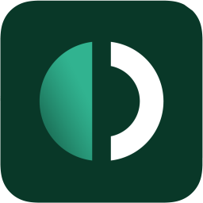

# 🛡️ Outline Web Manager

<p align="center">
  
</p>

<p align="center">
  <strong>Panel de control moderno, reactivo y de alta fidelidad para servidores Outline VPN.</strong><br>
  Construido con <strong>FastAPI</strong>, una interfaz <strong>Liquid Glass</strong> ultra-elegante, iconografía <strong>Hugeicons</strong> y arquitectura <strong>PWA</strong> sin recargas.
</p>

<p align="center">
  
  
  
  
  
</p>

---

## ✨ Características Principales

* 💎 **Diseño Liquid Glass**: Interfaz moderna con fondos oscuros obsidianos, orbes lumínicos orgánicos animados, efectos de refracción cáustica y paneles de cristal esmerilado con micro-interacciones táctiles.
* ⚡ **Experiencia Zero-Reload (AJAX)**: Todas las operaciones críticas (crear claves, renombrar, asignar cuotas, suspender tráfico y eliminar) se realizan en segundo plano vía Fetch API sin recargas molestas de página.
* 📊 **Analítica Gráfica en Tiempo Real**: Gráfica de distribución de ancho de banda por cliente impulsada por Chart.js con paleta neón adaptativa.
* ⏱️ **Medidor de Latencia en Vivo (Ping)**: Diagnóstico de conectividad continuo con indicador pulsante en tiempo real hacia la API de tu servidor Outline.
* ⏸️ **Pausa y Suspensión de Claves**: Posibilidad de suspender temporalmente el tráfico de cualquier clave sin tener que eliminarla del servidor.
* 🔗 **Página de Invitación 1-Click (`/invite/{key_id}`)**: Portal amigable para compartir con usuarios finales con botón de conexión directa en Outline (`outline://`), links a tiendas oficiales (iOS, Android, macOS, Windows) y código QR nítido.
* 🌐 **Soporte Multi-Servidor**: Gestor de perfiles guardados para alternar entre diferentes servidores y nodos Outline al instante desde la barra de navegación.
* 📱 **PWA (Progressive Web App)**: Totalmente instalable en iOS, Android, macOS y Windows como aplicación nativa independiente con soporte offline para assets.
* 🔒 **Seguridad y Compatibilidad**: Compatible con Python 3.12+, soporte para IDs de clave alfanuméricos y cookies seguras con flags `HttpOnly` y `SameSite`.

---

## 🚀 Inicio Rápido

### Opción 1: Con Docker Compose (Recomendado)

```bash
# Clonar repositorio
git clone https://github.com/ElJoker63/OUTLINE-WEB.git
cd OUTLINE-WEB

# Iniciar contenedor
docker compose up -d
```
Abre tu navegador en: **`http://localhost:8001`**

---

### Opción 2: Instalación Local con Python

```bash
# 1. Crear entorno virtual
python -m venv .venv

# En Windows:
.\.venv\Scripts\activate
# En Linux / macOS:
source .venv/bin/activate

# 2. Instalar dependencias
pip install -r requirements.txt

# 3. Iniciar el servidor
python main.py
```
El servidor escuchará en: **`http://localhost:8001`**

---

## 🔑 Cómo Conectar tu Servidor Outline

1. Instala tu servidor Outline en tu VPS (ej. DigitalOcean, AWS, GCP, Hetzner) ejecutando el script oficial:
   ```bash
   sudo bash -c "$(wget -qO- https://raw.githubusercontent.com/Jigsaw-Code/outline-server/master/src/server_manager/install_scripts/install_server.sh)"
   ```
2. Al terminar, la terminal te entregará una cadena JSON con tus credenciales:
   ```json
   {"apiUrl":"https://X.X.X.X:PORT/xxx","certSha256":"XXXXXXXXXXXXXXXXXXXXXXXXXXXXXXXXXXXXXXXXXXXXXXXXXXXXXXXXXXXXXXXX"}
   ```
3. Abre **Outline Web Manager**, pega la cadena en el campo de acceso y pulsa **Access Server Dashboard**.

---

## 🛠️ Rutas y API REST

| Método | Endpoint | Descripción |
| :--- | :--- | :--- |
| `GET` | `/` | Dashboard principal (o portal de acceso si no hay sesión) |
| `POST` | `/sign-in` | Autenticación con credenciales JSON |
| `POST` | `/logout` | Cierre de sesión y limpieza de cookies |
| `GET` | `/invite/{key_id}` | Página de bienvenida e invitación para clientes |
| `GET` | `/api/ping` | Medición de latencia / ping en milisegundos hacia Outline |
| `GET` | `/api/stats` | Estadísticas globales, uso de red y claves en JSON |
| `POST` | `/api/keys/add` | Creación de nueva clave de acceso |
| `POST` | `/api/keys/{key_id}/rename` | Renombrar clave existente |
| `POST` | `/api/keys/{key_id}/limit` | Asignar cuota de transferencia (GB) |
| `POST` | `/api/keys/{key_id}/delete-limit` | Eliminar límite individual de transferencia |
| `POST` | `/api/keys/{key_id}/toggle-pause` | Suspender / Reactivar tráfico de una clave |
| `POST` | `/api/keys/{key_id}/delete` | Eliminación definitiva de una clave |
| `GET` | `/version` | Comprobación de salud y versión del servicio |

---

## 📁 Estructura del Proyecto

```plaintext
OUTLINE-WEB/
├── static/
│   ├── dist/
│   │   ├── css/
│   │   │   └── liquid-glass.css    # Sistema de diseño Liquid Glass
│   │   └── js/
│   │       └── liquid-app.js       # Motor reactivo AJAX y analítica
│   ├── images/                     # Logotipos e isotipos
│   ├── manifest.json               # Manifiesto PWA para instalación nativa
│   └── sw.js                       # Service Worker para caché PWA
├── templates/
│   ├── main.html                   # Dashboard de gestión central
│   ├── sign-in.html                # Portal de inicio de sesión seguro
│   └── invite.html                 # Landing page de invitación para clientes
├── Dockerfile                      # Imagen ligera basada en Python 3.12-slim
├── docker-compose.yml              # Orquestación de despliegue con 1 comando
├── requirements.txt                # Dependencias validadas
├── main.py                         # Servidor principal y API FastAPI
└── README.md                       # Documentación del proyecto
```

---

## 🛡️ Licencia

Distribuido bajo la licencia [MIT](LICENSE). Siéntete libre de utilizarlo, modificarlo y desplegarlo en tu infraestructura privada.
